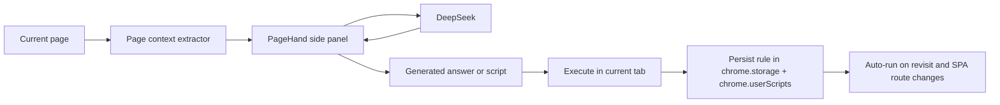

# PageHand

<p align="center">
  <strong>An AI side panel for understanding the current page, generating page scripts, and replaying them automatically.</strong>
</p>

<p align="center">
  <a href="https://github.com/lwxyfer/pagehand/releases"></a>
  <a href="https://github.com/lwxyfer/pagehand/blob/main/LICENCE"></a>
  
  
  
</p>

PageHand turns the Chrome side panel into a lightweight page copilot.

It can read the current page, answer questions about what is on screen, generate page-modification scripts from natural language, and keep those scripts running on future visits. It is built for people who want a practical AI browser tool, not just a chatbot living inside a sidebar.

## Why PageHand

Most browser AI tools stop at summarization.

PageHand goes one step further:

1. Read the current page context.
2. Generate a useful answer or a runnable page script.
3. Let you execute the script from chat.
4. Persist the script and replay it automatically next time.

That makes it useful for repeated personal workflows such as cleaning noisy pages, adding reading aids, highlighting actions, inserting helper UI, or tailoring internal tools for yourself.

## Highlights

- Chat with the current page instead of a blank LLM session.
- Toggle search per message when you want extra context.
- Switch into script mode to ask for page changes in plain language.
- Execute generated scripts directly from the conversation.
- Persist scripts by `path`, `exact`, or `domain` scope.
- Run multiple scripts on the same page.
- Re-apply matching scripts on SPA route changes.
- Inspect effective scripts for the current page and enable or disable them quickly.
- Use a compact chat-first UI with prompt library shortcuts.
- Support `light`, `dark`, and `auto` themes.

## How It Works



## Core Capabilities

### 1. Current-page assistant

PageHand answers with awareness of the active tab.

Example prompts:

- `总结当前页面`
- `提取这个页面的关键信息`
- `说明这个页面下一步最值得做的事情`
- `把当前页面结构拆解给我`

### 2. Script generation mode

Enable script mode when you want the model to modify the page instead of only answering.

Example prompts:

- `移除广告和推荐区，让正文更干净`
- `在标题下方插入一张摘要卡片`
- `高亮当前页面最关键的 CTA`
- `把正文翻译成简体中文，但保留排版`

The assistant returns a script card in chat. You choose a persistence scope and click `执行`.

### 3. Persistent page scripting

After execution, PageHand stores the rule locally and registers it with `chrome.userScripts`.

That gives you:

- automatic replay on revisit
- reusable site rules
- layered rules for the same page
- stable personal page customization without re-prompting every time

### 4. SPA-aware replay

For single-page applications, PageHand listens for route transitions and re-runs matching rules when the URL changes.

### 5. Active rule visibility

The side panel shows whether the current page already has matching scripts and lets you:

- inspect effective status
- run a rule immediately
- enable or disable a rule

## Product Principles

- Chat-first: the side panel should feel like a normal assistant.
- Minimal friction: search and script mode are simple toggles next to send.
- Personal automation: generated scripts are for self-use and repeated workflows.
- Local ownership: settings and rules live in browser storage.
- Fast iteration: generate, execute, refine, and keep the result.

## Installation

### 1. Clone the repository

```bash
git clone https://github.com/lwxyfer/pagehand.git
cd pagehand
```

### 2. Install dependencies

```bash
npm install
```

### 3. Build the extension

```bash
npm run build
```

### 4. Load the unpacked build

Open `chrome://extensions`, enable Developer Mode, and load:

```text
build/chrome-mv3
```

### 5. Enable User Scripts

In the extension details page, turn on:

```text
Allow User Scripts
```

This is required for persistent script replay.

## Quick Start

1. Open a normal `http`, `https`, or `file` page.
2. Open PageHand from the Chrome side panel.
3. Open Settings and add your DeepSeek API key.
4. Try a quick action such as `总结当前页面`.
5. Turn on script mode and ask for a page modification.
6. Choose a scope and click `执行`.
7. Revisit the page and confirm the script auto-runs.

## Configuration

The settings page includes:

- DeepSeek API key
- Base URL
- Model
- Temperature
- Max tokens
- Theme mode: `light`, `dark`, `auto`
- Default script scope
- Prompt Library
- Site-specific instructions

## Permissions

PageHand uses these core Chrome capabilities:

- `sidePanel` for the chat UI
- `storage` for settings and persistent rules
- `tabs` and `activeTab` for current-tab awareness
- `scripting` to inject the page bridge when needed
- `userScripts` to persist and replay generated page scripts

Host permissions are limited to `http`, `https`, and `file` pages.

## Development

Run local development:

```bash
npm run dev
```

Type-check the project:

```bash
npm run compile
```

Build production assets:

```bash
npm run build
```

Create a distributable zip:

```bash
npm run zip
```

## Project Structure

```text
src/
  app/
    sidepanel/            # chat-first side panel UI
    options/              # full settings page
    deepseek.ts           # model integration
    page-context.ts       # current-page extraction
    prompts.ts            # analyze/script prompts
    runtime.ts            # userScripts registration and execution
    storage.ts            # settings and rule persistence
  app-entries/
    background.ts         # orchestration and message routing
    page-bridge.content.ts
    sidepanel/
    options/
scripts/
  validate-deepseek.ts    # local verification helper
```

## Use Cases

- Clean cluttered articles and focus on the main content.
- Add custom reading aids to documentation pages.
- Highlight internal workflow steps on dashboards or consoles.
- Insert summaries, notes, or action cards into repeated work pages.
- Build lightweight personal augmentations for SaaS tools without maintaining a full userscript stack manually.

## Limitations

- Chrome internal pages such as `chrome://` are not supported.
- Arbitrary script side effects cannot always be reversed safely without reloading the page.
- Script quality depends on the target DOM and the generated code.
- The project currently targets Chromium-based browsers, not Firefox.

## Safety Notes

- Generated scripts are code and should be treated seriously.
- PageHand is intended for self-use, controlled environments, and trusted workflows.
- Avoid script generation on sensitive pages such as banking, payment, identity, or production admin systems.

## Privacy

- Settings and script rules are stored locally in browser storage.
- Current page content is sent to the configured AI endpoint only when you ask for analysis or script generation.
- PageHand does not require a hosted backend to function.

## Acknowledgements

PageHand started from the excellent [Page Assist](https://github.com/n4ze3m/page-assist) codebase and was reshaped into a focused current-page assistant plus persistent page scripting tool.

## Roadmap

- reversible script runtime for true no-refresh disable
- rule grouping and batch execution controls
- import and export for personal script libraries
- richer script inspection and debugging tools

## License

[MIT](./LICENCE)
